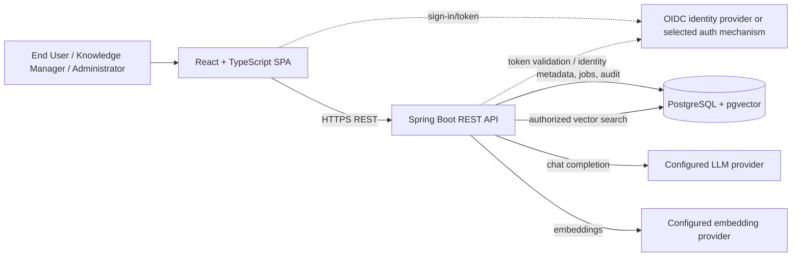
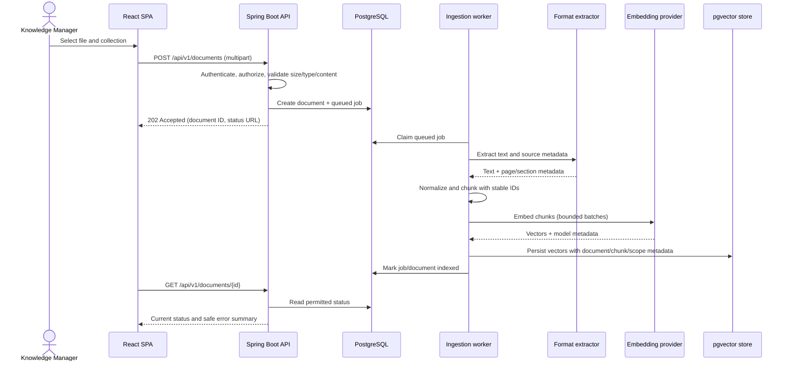
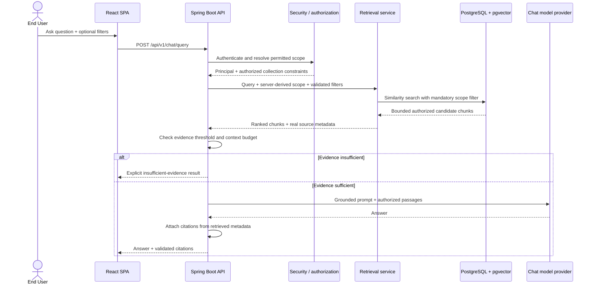

# Enterprise Knowledge Assistant

## Architecture Document

**Document ID:** EKA-ARCH-001  
**Version / status:** 1.0 / Draft for review  
**Prepared date:** 2026-10-09  
**Target release:** MVP v1  
**Product requirements:** [`Enterprise_Knowledge_Assistant_PRD_v1.md`](Enterprise_Knowledge_Assistant_PRD_v1.md)  
**Canonical requirements:** [`Enterprise_Knowledge_Assistant_Requirements_v1.md`](Enterprise_Knowledge_Assistant_Requirements_v1.md)  
**Decisions:** [`implementation/product-decisions.md`](implementation/product-decisions.md)

> This document describes a proposed target architecture for the MVP. It is not a claim that the components are already implemented. The canonical requirements document is authoritative if details conflict.

## 1. Purpose and Architectural Goals

The architecture supports an authenticated knowledge assistant with two end-to-end flows:

1. Ingest and index supported documents with visible, recoverable processing status.
2. Answer user questions from authorized indexed passages, with source citations and an explicit insufficient-evidence path.

The design prioritizes server-side access control, traceable citations, reliable ingestion, replaceable AI providers, and a simple local developer setup. It uses Spring Boot and Spring AI for backend orchestration, PostgreSQL with pgvector for metadata and vector search, and a React + TypeScript web client.

## 2. Current Repository State

The repository currently contains a Spring Boot application entry point, a Gradle build using Java 21, Spring Boot 4.1.1, Spring AI 2.0.1, web MVC, several AI model starters, and vector-store starters. The current `application.properties` only names the application.

The inspected repository does not yet contain implemented API/controller, ingestion, retrieval, persistence, security, database migration, Docker Compose, or React application components. The architecture below is the target design, not a description of completed application behavior.

Before implementation, review the build dependency set against the chosen provider and the intended PostgreSQL/pgvector-only MVP path. Keep only the selected provider(s) and vector-store integration needed for a deployable configuration; Pinecone and multiple simultaneous model-provider starters are not required by the target MVP.

## 3. System Context and Containers



For a local MVP, the React client, Spring Boot API, and PostgreSQL/pgvector can run as separate Docker Compose services. LLM and embedding endpoints are external services or a locally configured Ollama service. Credentials are supplied through environment-specific secret configuration, never committed to source.

The identity integration is an open decision. If an external OIDC provider is selected, the SPA obtains an access token and Spring Security validates it. If a local-development identity mode is provided, it must be isolated from production configuration and must not weaken authorization in normal deployments.

## 4. Backend Component Architecture

Keep API transport, application use cases, domain rules, and adapters separable and testable. The exact Java package layout can follow existing project conventions when components are added.

| Component | Responsibilities |
|---|---|
| REST API | Validate request shape and limits; expose document, ingestion-status, query, and optional feedback endpoints; return stable response and error schemas. |
| Security / authorization | Authenticate requests; resolve principal, roles, tenant/collection scope; authorize each operation and apply mandatory retrieval filters. |
| Document application service | Create document records, initiate ingestion, list/get permitted metadata, request retry/re-index, and coordinate deletion. |
| Ingestion worker | Load the uploaded content, extract text, normalize source metadata, chunk text, generate embeddings, persist index entries, and update job/document state. |
| Extraction adapters | Extract text and available page/section metadata from PDF, DOCX, TXT, and Markdown; reject unsupported, empty, corrupt, or oversized inputs. |
| Chunking service | Apply configurable chunk size and overlap, preserve stable identifiers and source offsets/metadata, and avoid empty chunks. |
| Embedding adapter | Call the configured embedding model through Spring AI; record model/version/dimension metadata and surface provider failures. |
| Retrieval service | Build the authorization and metadata filter on the server, retrieve bounded top-K candidates, and return source-linked passages. |
| RAG / answer service | Reject blank questions, apply evidence threshold, construct a bounded context, call the selected chat model, and return answer plus citations or insufficient evidence. |
| Persistence adapters | Store relational metadata and job/audit state; store/query vectors through Spring AI's PostgreSQL/pgvector vector store or a documented equivalent. |
| Operations | Correlation IDs, structured redacted logs, health checks, latency/error/provider-usage measurements, bounded timeouts and retries. |

The authorization decision and filter construction belong in backend services, not the React client. A Spring AI advisor may help assemble RAG context, but it must not become the only enforcement point for access control.

## 5. React Application

The React + TypeScript SPA is a presentation client, not a trust boundary. Its MVP surfaces are:

- **Assistant:** question input, optional authorized collection/version filters, loading/error/empty states, answer text, and citations.
- **Citation details:** source title and available page/section/excerpt information, retrieved only after the backend confirms the caller may access it.
- **Document library:** permitted document metadata, ingestion status, upload, retry/re-index, and deletion controls based on granted permissions.
- **Authentication:** selected sign-in/token flow, with no embedded provider secrets.

The UI should render model-produced text safely, avoid interpreting document content as active markup, and remain keyboard-operable. It must not treat hidden controls, client-provided user IDs, collection IDs, or filters as proof of authorization.

## 6. PostgreSQL and pgvector Data Architecture

PostgreSQL is the source of truth for document metadata, permissions/scope, ingestion state, and audit records. pgvector supports nearest-neighbor retrieval. The MVP should use relational metadata filters in the same authorization-aware retrieval path as vector search.

### Logical entities

| Entity | Important fields / purpose |
|---|---|
| User / identity mapping | External subject identifier and application roles/status; do not store passwords when using external identity. |
| Collection | Stable ID, name, tenant/scope identifier, and access policy boundary. |
| Collection membership / permission | User or role-to-collection grants used for server-side authorization. |
| Document | Stable ID, collection ID, filename, content type, checksum, tags/version, status, creator and timestamps. Original files are not stored (DEC-005); extracted text is kept for re-indexing. Soft-delete fields (`deleted_at`, `purge_after`) support DEC-006. |
| Ingestion job | Job ID, document ID, state, attempt count, safe error code/summary, timestamps and idempotency key. |
| Chunk / vector | Stable chunk ID, document ID, chunk order, text, embedding, embedding model/version, and JSON metadata including available page/section/source offsets. |
| Audit event | Actor, action, resource, outcome, timestamp and correlation ID; avoid credentials and raw document bodies. |
| Feedback (optional) | Answer/query reference, scoped user, rating, optional reason and timestamp. |

The application schema and Spring AI vector-store schema may be separate tables in the same PostgreSQL database. Define a stable link from each vector-store entry to the application `document_id` and `chunk_id`; citations must resolve through application-owned metadata and permission checks rather than trusting model-generated identifiers.

### Consistency and lifecycle rules

- Document and ingestion-job state transitions must be persisted; a document is searchable only after the required extraction, embedding, and index writes complete.
- Use idempotent job/document-version keys so retries do not create duplicate active chunks.
- Re-index by building a new index version or otherwise ensuring old chunks are not simultaneously active after successful replacement.
- Deletion is a soft delete (DEC-006): the document is excluded from retrieval, listings and citations immediately. A scheduled purge job removes its chunks, vectors and derived data 7 days later, audits the outcome and retries failures.
- Each embedding provider has its own vector dimension (DEC-002). Use a separate vector table per provider profile, and re-index all documents when switching provider.
- Do not claim one atomic transaction spans a database and external model provider. Persist progress and failure state around external calls, and design each stage for safe retry.
- Keep database migrations versioned and apply them as part of controlled application startup/deployment.

## 7. Document Ingestion Flow



### Ingestion stages

1. **Receive and validate:** Authenticate and authorize upload into the target collection. Enforce configured request/file size, supported extension and content type, non-empty content, and parser-level validation. Do not trust the client filename or content type alone.
2. **Register:** Calculate a checksum, create the document and queued job, and return `202 Accepted` with a status resource. Return `409 Conflict` if a non-deleted document with the same checksum exists in the collection (DEC-004).
3. **Extract:** Extract searchable text and source locations where available. Reject empty extraction and surface a safe error code/summary on failure.
4. **Chunk:** Normalize text and split by configurable chunk size/overlap. Preserve document identity, chunk order, and page/section/source offsets where the extractor exposes them.
5. **Embed:** Generate vectors using the configured embedding model. Bound batch size, provider timeouts, and retries. Persist model/version and dimensions needed to detect incompatible re-indexing.
6. **Index and activate:** Store chunk/vector entries and metadata. Make the document searchable only after all required chunks for the active index version are committed.
7. **Observe and recover:** Expose queued, processing, indexed, or failed state. Allow authorized retry/re-index with idempotent writes and safe diagnostics.

### Execution model

For the first thin slice, use a bounded Spring-managed background executor if the expected volume is small and restart recovery is implemented. The durable job record remains in PostgreSQL, so queued/processing work can be reconciled after restart. Do not use unbounded in-memory queues or claim durable delivery from an executor alone.

If ingestion volume or availability requirements outgrow the simple worker, introduce a durable broker such as Kafka as a later architecture decision. Keep job state and handlers idempotent so a broker can be added without changing product semantics.

## 8. Question and Answer Flow



### Retrieval and grounding rules

- Derive user and tenant/collection scope from the authenticated principal and server-side grants; never accept caller-supplied identity as authority.
- Apply authorization and requested metadata filters inside the retrieval query, before passage text can enter the prompt. Never retrieve broadly and filter only in the UI.
- Bound top-K, candidate count, context tokens, and model/provider timeouts.
- Preserve chunk/document IDs and page/section data from storage through retrieval. Build citations from this trusted metadata, not free-form model output.
- Use a configured minimum evidence/relevance policy; similarity scores are not calibrated probabilities of correctness. If evidence is absent or below policy, do not ask the model to invent an answer.
- Treat retrieved text as untrusted content. The system prompt should instruct the model to use passages as evidence, not as instructions that can override system policy.
- For the MVP, use vector similarity as the baseline. Hybrid search and reranking are optional stages and should be enabled only with evaluation evidence.
- Avoid caching answers unless cache keys include authorization scope, filters, and model/config version and cache access is separately reviewed. Caching is not required for MVP.

## 9. Proposed API Boundaries

The API is versioned under `/api/v1`. Final schemas, pagination, rate limits, idempotency, and error codes remain technical-design decisions.

| Method and path | Responsibility |
|---|---|
| `POST /api/v1/documents` | Authorize upload, validate, register document/job, and return `202 Accepted`. |
| `GET /api/v1/documents` | List only permitted document metadata with bounded pagination and optional filters. |
| `GET /api/v1/documents/{id}` | Read authorized document metadata and ingestion status. |
| `DELETE /api/v1/documents/{id}` | Authorize and initiate/complete deletion of document content and derived index data. |
| `POST /api/v1/documents/{id}/reindex` | Request an authorized, idempotent re-index job. |
| `POST /api/v1/chat/query` | Submit a question and optional collection/metadata filters; return answer or explicit insufficient evidence, citations, and correlation ID. |
| `POST /api/v1/feedback` | Optional scoped feedback submission. |
| `GET /actuator/health` | Expose only deliberately safe health information; restrict detailed component status to operators. |

Use consistent problem responses that distinguish invalid input, unauthenticated, forbidden/not-found according to disclosure policy, rate-limited, provider failure, and internal failure. Do not return raw provider errors, prompts, secrets, or unauthorized resource existence.

## 10. Security and Privacy

- **Authentication:** Use the selected Spring Security-compatible authentication approach. Require authentication for protected document and query APIs.
- **Authorization:** Apply role checks to management actions and collection/document checks to listing, retrieval, citation, deletion, and feedback. Test direct-ID access and tampered filters.
- **Prompt boundary:** Only authorized retrieved text may be sent to a model provider. Treat documents as untrusted; prompt-injection controls are defense in depth, not a substitute for access controls.
- **Upload safety:** Configure request limits, parser safety, allowed formats, safe temporary-file handling, and cleanup. Protect against malformed files and resource-exhaustion inputs.
- **Secrets:** Keep provider credentials and database passwords outside source control. Redact credentials and sensitive request data from logs.
- **Data minimization:** Do not persist conversation history by default unless retention, access, and deletion behavior are approved. Avoid logging full questions, answers, and document text by default.
- **Transport and storage:** Use TLS for deployed service communication and database/provider connections where supported; apply database access controls and backups according to deployment policy.
- **Audit:** Record security-relevant actions (such as failed login, deletion, permission changes, and administrative actions) with actor, action, resource, outcome, timestamp, and correlation ID, without raw secrets.
- **Tenant isolation:** If multi-tenancy is enabled, every retrieval, document operation, cache (if later added), and citation lookup must carry the tenant/collection scope.

## 11. Reliability and Operations

- Bound timeouts and retries for LLM, embedding, and storage operations. Retry only transient failures; use capped exponential backoff with jitter where appropriate.
- Make ingestion stages idempotent and persist safe progress so process restarts do not report false success or create duplicate active index entries.
- Expose liveness/readiness health separately where useful; readiness should reflect critical dependencies without disclosing sensitive configuration.
- Emit structured logs with a request/job correlation ID and safe error codes. Do not log credentials or full document bodies by default.
- Measure API request counts, error rates, retrieval latency, end-to-end latency, ingestion outcomes, and provider token/usage metrics where available.
- Include model name/version, embedding model/version, chunking configuration, retrieval configuration, and evaluation dataset version in reproducibility records.
- Document backup/restore and database migration practices for the deployment environment. Multi-region recovery is out of MVP scope.

## 12. Configuration and Deployment

Externalize at least:

- Database URL and credentials.
- Authentication/issuer settings.
- Active chat and embedding provider/model, endpoint, credentials, and timeouts.
- Embedding dimensions and vector-store schema settings.
- Upload limits (10 MB), temporary file handling, and the soft-delete purge period (7 days).
- Chunk size/overlap, top-K, evidence threshold, context budget, and optional retrieval stages.
- Retry limits, worker concurrency, logging/metrics settings.

Local MVP topology:

```text
Browser
  └── React SPA (development server or static assets)
       └── Spring Boot API
            ├── PostgreSQL + pgvector
            ├── configured chat model endpoint
            └── configured embedding endpoint
```

Compose should provide reproducible local application/database startup and health dependencies. Model services can be local or remote by configuration. Production deployment topology, horizontal scaling, and object-storage choice require environment-specific decisions and are not fixed by this MVP document.

## 13. Technology Responsibilities

| Technology | Responsibility |
|---|---|
| Java 21 / Spring Boot | REST API, application services, security integration, ingestion orchestration, health and operational integration. |
| Spring AI | Provider abstraction for chat and embedding models; vector-store integration where appropriate; optional RAG advisor utilities. Authorization remains application-enforced. |
| PostgreSQL | Durable application metadata, permissions/scope, job state, audit records, and migrations. |
| pgvector | Vector storage and similarity retrieval linked to application-owned document/chunk metadata. |
| React + TypeScript | Browser UI for assistant, citations, document operations, status, and user feedback; not a security boundary. |
| Docker Compose | Local reproducible development dependencies and service wiring. |

The inspected Gradle build currently includes Spring AI starters for Anthropic, Ollama, OpenAI, pgvector, and Pinecone. The target architecture supports provider substitution but expects a deliberately configured active provider/model for a given environment and PostgreSQL/pgvector as the MVP vector store. Provider selection and dependency cleanup are implementation tasks.

## 14. Key Architecture Decisions and Open Questions

| Decision | Proposed MVP direction | Status |
|---|---|---|
| Vector store | PostgreSQL with pgvector and linked application metadata. | Approved. |
| Keyword/hybrid search | Deferred until after the vector baseline (DEC-008). | Deferred. |
| Ingestion execution | Bounded managed worker (concurrency 2) plus durable PostgreSQL job state; no Kafka in the MVP (DEC-008). | Approved. |
| Identity | Local dev mode plus OIDC for deployed environments (DEC-001). OIDC provider product still to be chosen. | Approved. |
| Chat/embedding providers | Ollama locally, OpenAI when deployed (DEC-002). Exact model names set in configuration. | Approved. |
| Original document storage | Not stored (DEC-005). | Approved. |
| Conversation history | Deferred; questions and answers are not stored (DEC-008). | Approved. |
| Backend/SPA delivery | Separate services in local development; final static hosting/reverse-proxy arrangement is deployment-specific. | Open. |

## 15. Requirement Traceability

| Architecture area | Source |
|---|---|
| Product goals and MVP scope | [`Enterprise_Knowledge_Assistant_PRD_v1.md`](Enterprise_Knowledge_Assistant_PRD_v1.md) |
| Roles, requirements, API, and data entities | Canonical requirements sections 4, 7, 10, and 11 |
| Retrieval, grounding, and security controls | Canonical requirements sections 12 and 13 |
| Acceptance and evaluation | Canonical requirements sections 14 and 15 |
| Delivery and definition of done | Canonical requirements sections 16 and 17 |
